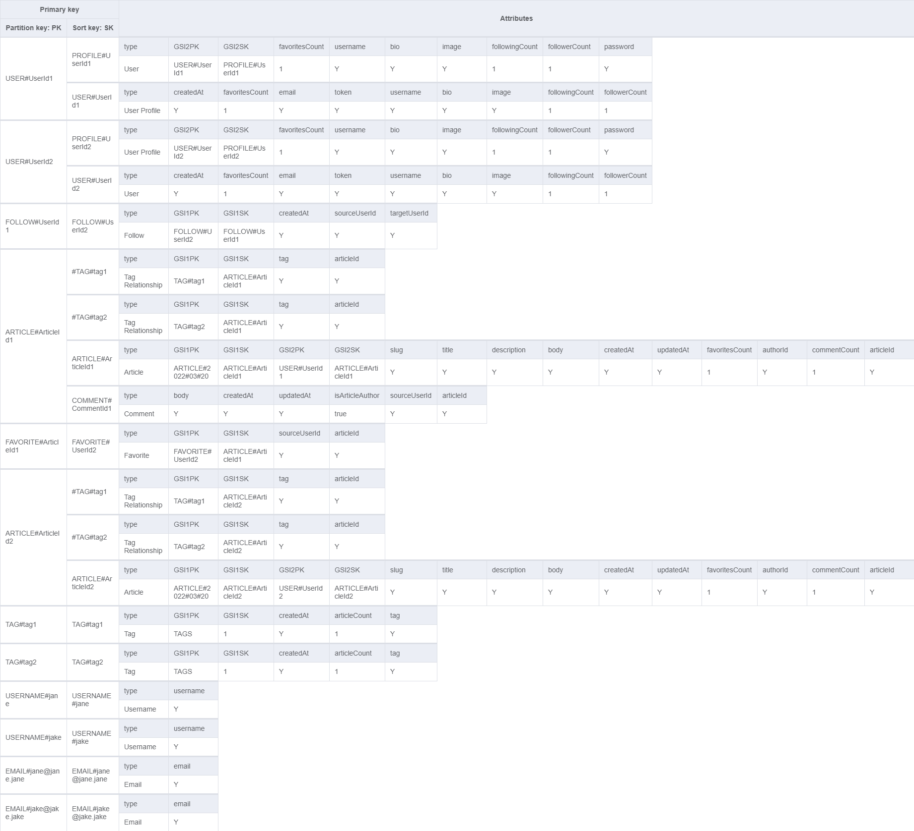
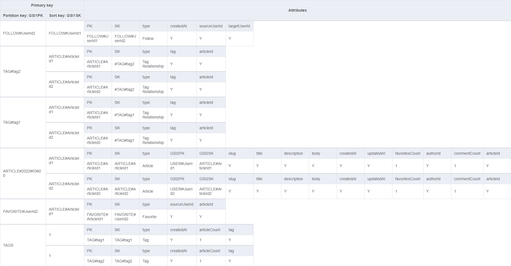

# A RealWorld Example App :woman_technologist:

This is a modified implementation of [RealWorld](https://realworld-docs.netlify.app/docs/intro), a project used to learn about frontend/backend frameworks by creating a blogging platform. Check out the [official demo](https://demo.realworld.io/#/).

## Table of Contents

- [Goals](#goals)
- [TODO](#todo)
- [Overview](#overview)
- [Resources](#resources)

## Goals

- [Short-term learning goals](#short-term-learning-goals)
- [Big hairy learning goals](#big-hairy-learning-goals)

### Short-term learning goals

- explore TailwindCSS
- get more comfortable with Next.js
- build proficiency in React
- learn about
  - implementing a backend using AWS
    - including DynamoDB, Lamba, API Gateway
    - and explore single-table design
  - caching strategies
  - pagination
  - authentication
- develop the habit of using [Conventional Commits](https://www.conventionalcommits.org/en/v1.0.0/)
- build proficiency with Git/GitHub version control
- deploy to Vercel

### Big hairy learning goals

- experiment with
  - Event-driven architecture
  - Micro-services
  - Micro-frontends
- implement
  - CI/CD
  - documentation
  - logging
  - analytics
  - i18n
  - TypeScript
  - Web3 version

## TODO

- [User CRUD](#user-crud--authentication)
- [Article CRUD](#article-crud)
- [Interactions](#interactions)
- [Bonus](#bonus-not-requiredspecified-in-realworld-specs)

### User CRU[D] & Authentication

- [ ] User can register
- [ ] User can login
- [ ] User can update own profile (email, username[\*](#special-requirements), password, image, bio)
- [ ] Get user by username
- [ ] Get profile by username

### Article CRUD

- [ ] List all articles, ordered by most recent first
  - [ ] List articles by tag
  - [ ] List articles written by username
  - [ ] List articles favourited by username
- [ ] Personalized article feed
  - [ ] List articles written by followed users, ordered by most recent first
- [ ] Articles are paginated
- [ ] Get an article by slug[\*](#special-requirements)
- [ ] User can create an article using Markdown
- [ ] User can update own articles (title[\*](#special-requirements), description, content)
- [ ] User can delete own articles

### Interactions

- [ ] List comments for an article
- [ ] Comments are paginated
- [ ] User can comment on an article (**BONUS**: using Markdown)
- [ ] User can delete own comments
- [ ] User can un/favourite articles
- [ ] User can un/follow other users

### Bonus (Not required/specified in RealWorld specs)

- [ ] User can update own comments (body)
- [ ] User can bookmark articles to read later
- [ ] User can view list of bookmarked articles, ordered by most recent(ly published) first
- [ ] User can delete their account
- [ ] User can create an article with image(s)
- [ ] Write sharding for article tags
- [ ] Admin dashboard
  - [ ] Admin can view activity insights for platform
- [ ] Author dashboard
  - [ ] Author can view activity insights for published articles (e.g. views)

## Overview

- [Entity Relationships](#entity-relationships)
- [Data Visualization](#data-visualization)
- [Endpoints](#endpoints)
- [Considerations](#considerations)

### Entity Relationships


### Data Visualization

|           Main Table            |                 Global Secondary Index 1                 |                 Global Secondary Index 2                 |
| :-----------------------------: | :------------------------------------------------------: | :------------------------------------------------------: |
|  |  |  |

_NOTE: The attribute values `Y`, `1`, and `true` in the above images indicate that the attribute exists for that item and the data type of the value (string, number, or boolean, respectively)._

### Endpoints

```
POST /api/users - Registration
POST /api/users/login - Authentication
POST /api/users/logout
POST /api/users/refresh - Refresh authentication tokens

GET /api/users/me - Get current user
PUT /api/users/me - Update current user

GET /api/users/:username/followers - List followers of user
GET /api/users/:username/following - List followings of user
POST /api/users/:username/following - Follow user
DELETE /api/users/:username/following - Unfollow user

GET /api/profiles/:username - Get profile
GET /api/profiles/me - Get current user's profile

POST /api/articles - Create article
GET /api/articles - List articles
GET /api/articles/feed - List feed articles

GET /api/articles/:slug - Get article
PUT /api/articles/:slug - Update article
DELETE /api/articles/:slug - Delete article

POST /api/articles/:slug/favorite - Favourite article
DELETE /api/articles/:slug/favorite - Unfavourite article

GET /api/articles/:slug/comments - List comments for article
POST /api/articles/:slug/comments - Add comment to article
PUT /api/articles/:slug/comments/:id - Edit comment
DELETE /api/articles/:slug/comments/:id - Delete comment

GET /api/tags - Get tags
```

Check out the original [RealWorld Endpoints](https://realworld-docs.netlify.app/docs/specs/backend-specs/endpoints)

### Considerations

- Slug must be updated when the author changes the title
- User can change their username
- Usernames should be unique
- Emails should be unique
- Article or comment author profile must be up-to-date
- Current user's following status must be shown when viewing another user's profile, including authors of articles and comments
- A high-traffic production app would likely require write-sharding for articles and article tags to avoid hot partitions

  This project will attempt to implement write-sharding for articles. A global secondary index with the partition key `ARTICLE#YYYY#MM#DD` (year, month, date the article was published) will be used when listing articles. Possible values will be the date the query was made (inclusive) until the date this app was "released" (inclusive).

  Write-sharding article tags could be implemented by showing the top `n` tags, as outlined in a [ "leaderboard" example by Alex De Brie](https://www.dynamodbguide.com/leaderboard-write-sharding). This method will most likely be used when implementing the [Bonus TODO](#bonus).

## Resources

- [Introducing RealWorld 🙌](https://medium.com/@ericsimons/introducing-realworld-6016654d36b5) article by Eric Simons
- [RealWorld Project Docs](https://realworld-docs.netlify.app/docs/intro)
- [Conduit](https://demo.realworld.io/#/) - the RealWorld demo app
- [Fullstack Authentication with Refresh Access Tokens](https://www.youtube.com/watch?v=xMsJPnjiRAc) YouTube tutorial by Florian Ludewig
- Marcia Villalba's [7 Common DynamoDB Patterns for Modeling and Building an App](https://www.youtube.com/watch?v=Q6-qWdsa8a4) YouTube video with Alex De Brie
- The DynamoDB Book by Alex De Brie
- Build APIs You Won't Hate by Phil Sturgeon

---

This [Next.js](https://nextjs.org/) project was bootstrapped with [`create-next-app`](https://github.com/vercel/next.js/tree/canary/packages/create-next-app). To learn more about Next.js, take a look at the following resources:

- [Next.js Documentation](https://nextjs.org/docs) - learn about Next.js features and API.
- [Learn Next.js](https://nextjs.org/learn) - an interactive Next.js tutorial.
